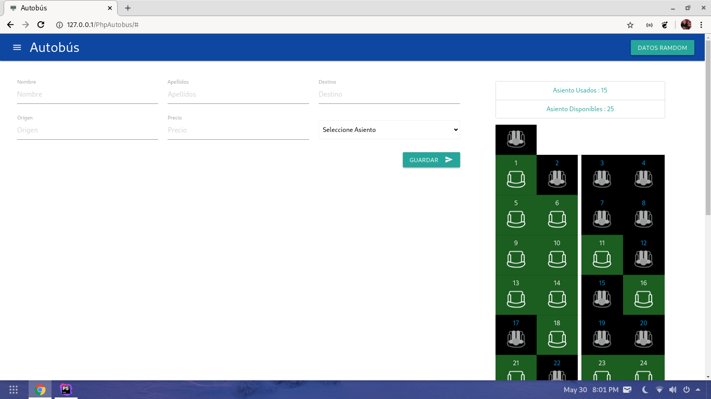
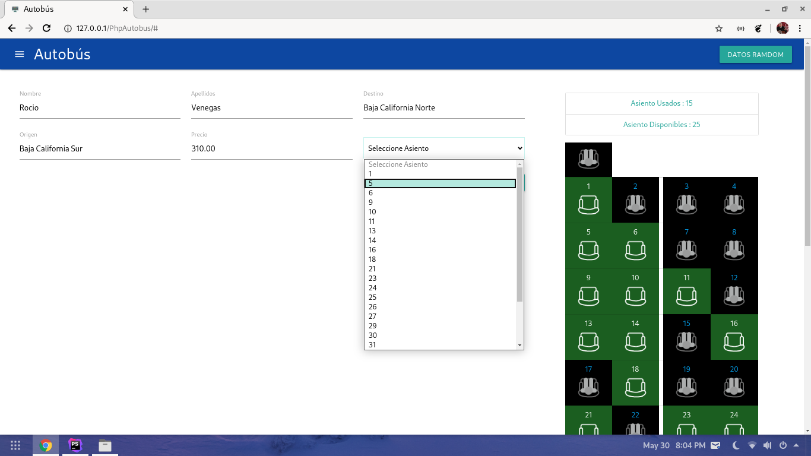
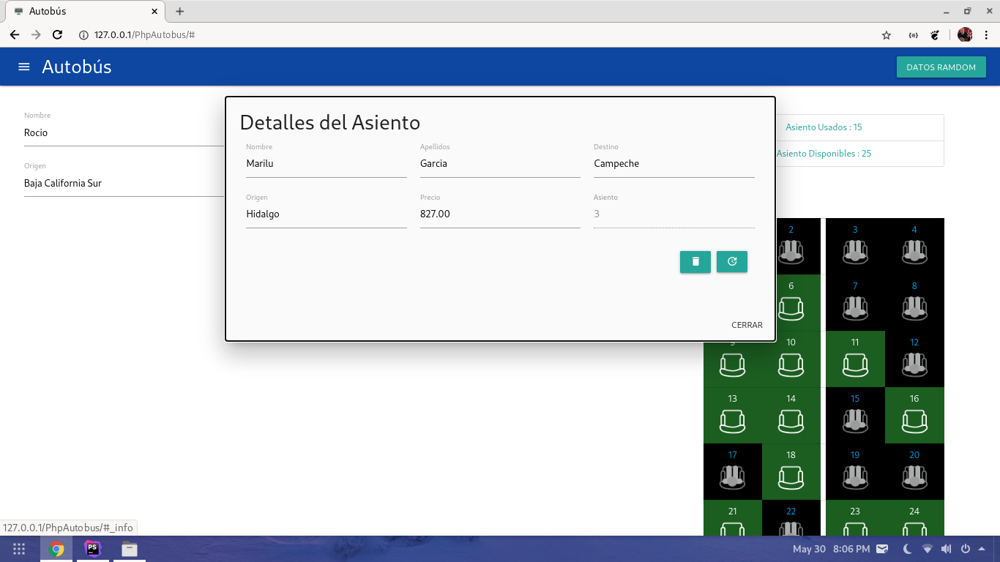
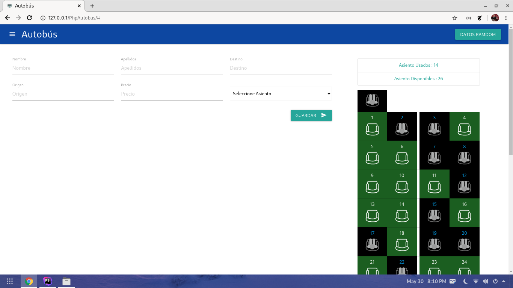

### Simulador de Autobús de Pasajero v2.1.2
#### [PHP-AJAX-MATERIALIZE-MVC]

El objetivo de este proyecto es realizar la simulación de un autobús de pasajeros con **PHP** utilizando los siguientes recursos:
- Framework Materialize.
- Peticiones AJAX.
- Sessiones en PHP.
- Programación Orientada a Objetos.
- Arquitectura MVC (Model-View-Controller).

### Característica
Con el *Simulador de Autobús* usted podrá:

- Generador de Datos.

- Venta de Boletos (Validación de Asiento Disponible).

- Mostrar la información del cliente.

- Actualizar la información del cliente.

- Eliminar asientos vendidos.

### Follow Us
- [Youtube](https://www.youtube.com/channel/UCh94p1M7dg1y9f_Yik1vGjw)
- [Facebook](https://www.fb.com/arteaprogramar/)  
- [Twitter](https://www.twitter.com/arteaprogramar/)
- [Instagram](https://www.instagram.com/arteaprogramar/)

### License
Please see [LICENSE](public/apache-license-2.0.md)
